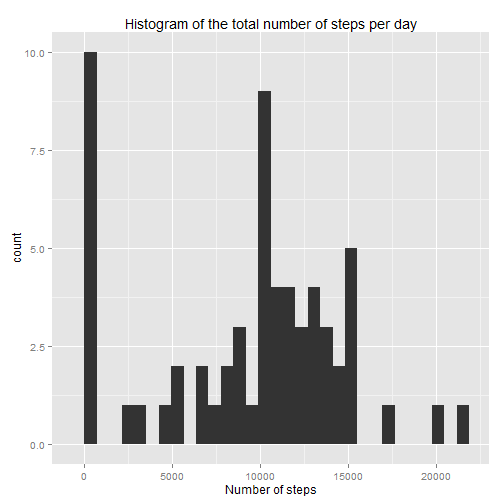

## Loading and preprocessing the data

Data is read and date is transformed to a date type.


```r
data = read.csv("activity.csv")
data$date = as.Date(data$date)              
```

## What is mean total number of steps taken per day?


```r
library(ggplot2)
steps = tapply(data$steps, data$date, sum, na.rm=TRUE)

qplot(steps,
      xlab="Number of steps",
      main="Histogram of the total number of steps per day")
```

```
## stat_bin: binwidth defaulted to range/30. Use 'binwidth = x' to adjust this.
```

 

```r
m1= mean(steps, na.rm=TRUE)
md1 = median(steps, na.rm=TRUE)
```

The mean and median number of steps taken per day are, 9354.2295 and 10395, respectively.

## What is the average daily activity pattern?


```r
st = tapply(data$steps, data$interval, mean, na.rm=TRUE)
plot(st ~ names(st), type="l", xlab="Interval",
    ylab="Mean number of steps",
    main="Average daily activity")


inte = names(which.max(st))
abline(v=inte, col="red")
```

 

The interval of the day with maximum number of steps is 835.

## Imputing missing values


```r
numberRows = sum(is.na(data$steps))
```

The number of rows with missing values is: 2304

The imputation of missing values is carried out by assigning to an interval the average number of steps (averaged over all days) for that interval. This is basically done by means of using "st[as.character(interval)]" whenever the interval contains an NA. st contains the average number of steps for each interval, each one identified (named) by interval.


```r
dataB = data

dataB$steps = as.numeric(
  Map(function(steps, interval) if(is.na(steps)) st[as.character(interval)] else steps,
                  dataB$steps,
                  dataB$interval))

stepsB  = tapply(dataB$steps, dataB$date, sum)
steps = tapply(data$steps, data$date, sum, na.rm=TRUE)


todosSteps = 
  rbind(
    data.frame(steps=stepsB, withImputation=TRUE),
    data.frame(steps=steps,  withImputation=FALSE))
    
ggplot(todosSteps, na.rm=TRUE, groups= withImputation, aes(steps, fill=withImputation))+geom_histogram(position="dodge")
```

```
## stat_bin: binwidth defaulted to range/30. Use 'binwidth = x' to adjust this.
```

 

```r
 m2 = mean(stepsB)
md2 = median(stepsB)
```

The previous plots show that there are differences from the estimates from the first part of the assignment: with imputation, there are fewer step values close to zero and more step values close to 10000.

The mean and median number of steps taken per day are, respectively, 1.0766 &times; 10<sup>4</sup> (with NAs it was 9354.2295) and 1.0766 &times; 10<sup>4</sup> (with NAs it was 10395).

## Are there differences in activity patterns between weekdays and weekends?

NOte: sábado and domingo mean saturday and sunday in Spanish.


```r
dataB$weekday = as.factor(ifelse(weekdays(as.Date(dataB$date)) %in% c("sábado","domingo"), "weekend", "weekday"))

library(plyr)
dataC = ddply(dataB, .(interval, weekday), summarise, st=mean(steps))

library(lattice)
xyplot(st ~ interval|weekday, data=dataC, type="l", auto.key=TRUE, ylab="Number of steps")
```

 

It can be seen that on weekdays, people do more steps early (before 10:00), while on weekends, steps are done mostly late (after 10:00). This can be seen more clearly in the following plot:


```r
dataB$weekday = as.factor(ifelse(weekdays(as.Date(dataB$date)) %in% c("sábado","domingo"), "weekend", "weekday"))

library(plyr)
dataC = ddply(dataB, .(interval, weekday), summarise, st=mean(steps))

library(lattice)
xyplot(st ~ interval, data=dataC, type="l", groups=weekday, auto.key=TRUE, ylab="Number of steps")
```

 


